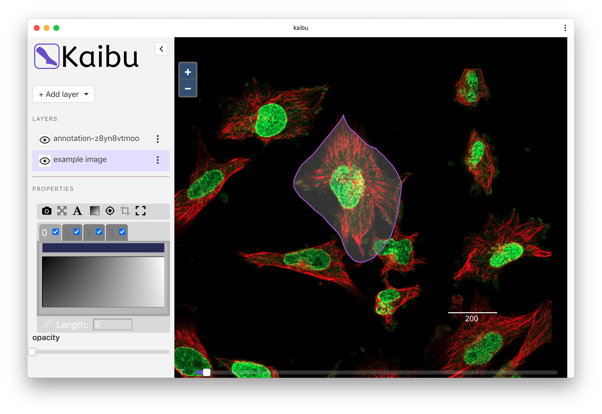

<a href="https://kaibu.org" target="_blank" ></img>
</a>

Kaibu is a web application for visualizing and annotating multi-dimensional images, built with [OpenLayers](https://openlayers.org/) and [itk-vtk-viewer](https://kitware.github.io/itk-vtk-viewer/).

----
***WARNING: This is a work-in-progress repo, you are welcome to try it out but it's not ready for use in production yet.***

## How to use it?

### As standalone appliction: https://kaibu.org



### As ImJoy plugin: https://imjoy.io/#/app?plugin=https://kaibu.org


You can use Kaibu in your ImJoy plugin, either in Javascript or Python,

Here is an example in Python:
```python
from imjoy import api
import numpy as np

class ImJoyPlugin():
    async def setup(self):
        pass

    async def run(self, ctx):
        viewer = await api.createWindow(src="https://kaibu.org/")

        # create a random image
        image = np.random.randint(0, 255, [500, 500], dtype='uint8')
        
        # or you can try if you also did `pip install imageio` and `import imageio`
        # image = imageio.imread("https://images.proteinatlas.org/19661/221_G2_1_red_green.jpg")

        # view image
        await viewer.view_image(image, type="itk-vtk", name="random pixels")
        
        # add polygon to a vector layer
        triangle = np.array([[11, 13], [111, 113], [22, 246]], dtype='uint16')
        await viewer.add_shapes([ triangle ], shape_type="polygon", edge_color="red", name="triangle")

        # add points to a vector layer
        points = np.random.randint(0, 500, [100, 2], dtype='uint16')
        await viewer.add_points(points, face_color="purple", name="points")

api.export(ImJoyPlugin())
```

Currently we support `view_image`, `add_shapes` and `add_points`, the definition is mostly the same as [napari](https://napari.org/).

You can also try the above code in a Jupyter notebook on binder, [click here](https://mybinder.org/v2/gh/imjoy-team/imjoy-binder-image/master?filepath=imjoy-jupyter-tutorial.ipynb) to launch a notebook on Binder (may take a while to start).

### In a Jupyter notebook
Run `pip install imjoy-jupyter-extension`, then start the the Jupyter notebook. Then you can use the above plugin example in the notebook.

You can also try the demo here: [](https://mybinder.org/v2/gh/oeway/690c2e62311223ae93e644d542eb8949/master?filepath=Kaibu-jupyter-example.ipynb)

## Why Kaibu?

`Kaibu` is [a small island in Fiji](https://www.google.com/maps/place/Kaibu+Island/), and we name it to pay tribute to the open source image processing package [Fiji](https://fiji.sc/)/[ImageJ](https://imagej.net). Meanwhile, the layered design of Kaibu is inspired by [Napari](https://napari.org/) which is also named after an island. `Kaibu` in Chinese(开步), it means "to step forward", and yes, it is time to step forward with Kaibu!

</img>


## License

MIT